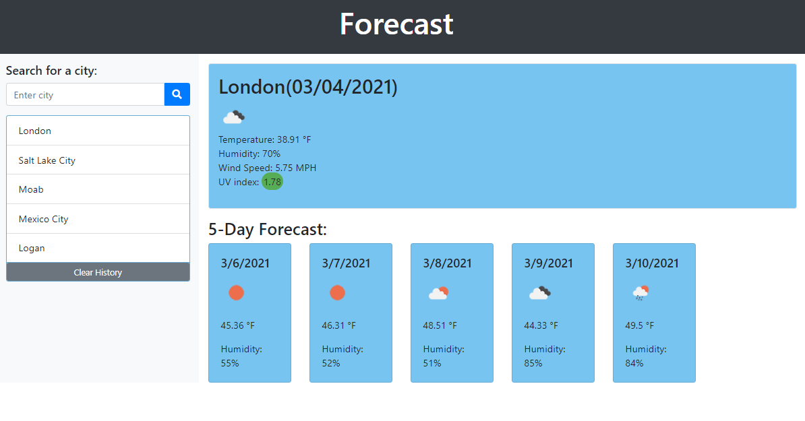

# Forecast

## Description
 Able to view the weather outlook for multiple cities so that a traveler can plan accordingly.
 Seeing the date, an icon representing weather condition, temp., humidity, wind speed, 
 and uv index of current weather. While also being presented with the next 5 days displaying the 
 date, an icon representing weather conditions, temp., and humidity. Search history will be stored
 up to 5 cities at a time. 
  

## Website

https://tessaustin.github.io/forecast/

## Screenshot

